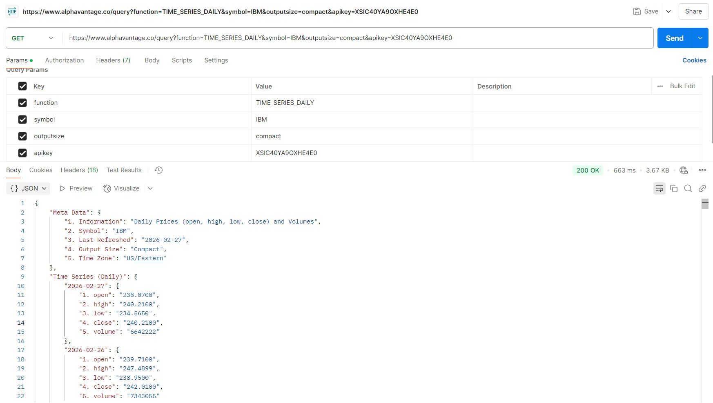
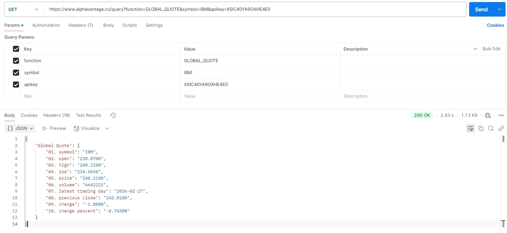
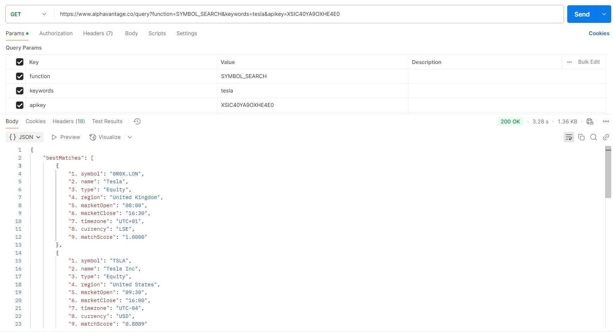
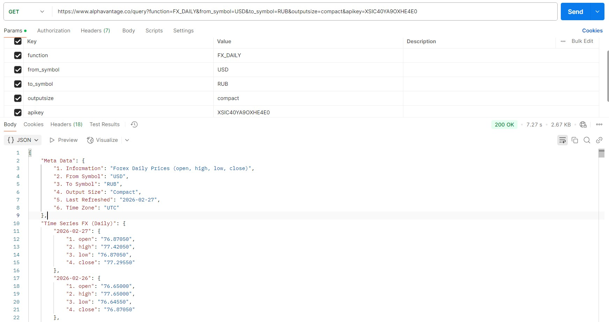
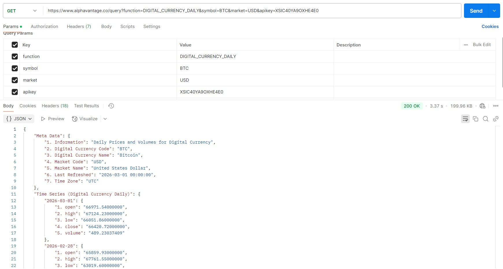

# Alpha Vantage API — примеры запросов (как в Postman)

Базовый URL: `https://www.alphavantage.co/query`  
Все запросы выполняются методом **GET** и используют query-параметры.


---

## Скриншоты

### 1) TIME_SERIES_DAILY (Daily prices for stocks)


### 2) GLOBAL_QUOTE (Текущая котировка)


### 3) SYMBOL_SEARCH (Поиск тикеров по ключевому слову)


### 4) FX_DAILY (Forex daily prices)


### 5) DIGITAL_CURRENCY_DAILY (Crypto daily prices)


---

## 1) Дневные цены акций (TIME_SERIES_DAILY)

### Назначение
Возвращает дневные свечи (open/high/low/close) и объёмы торгов по выбранному тикеру.

### Запрос
**GET**
```
https://www.alphavantage.co/query?function=TIME_SERIES_DAILY&symbol=IBM&outputsize=compact&apikey=YOUR_API_KEY
```

### Параметры
- `function=TIME_SERIES_DAILY` — тип данных (дневной таймсерис)
- `symbol=IBM` — тикер (например: IBM, AAPL, MSFT)
- `outputsize=compact` — размер выборки:
    - `compact` (последние ~100 точек)
    - `full` (максимум доступных точек)
- `apikey=YOUR_API_KEY` — ключ API

---

## 2) Текущая котировка (GLOBAL_QUOTE)

### Назначение
Возвращает текущие значения котировки по тикеру (цена, изменение, процент и т.д.).

### Запрос
**GET**
```
https://www.alphavantage.co/query?function=GLOBAL_QUOTE&symbol=IBM&apikey=YOUR_API_KEY
```

### Параметры
- `function=GLOBAL_QUOTE`
- `symbol=IBM`
- `apikey=YOUR_API_KEY`

---

## 3) Поиск тикера по ключевому слову (SYMBOL_SEARCH)

### Назначение
Позволяет искать тикеры по строке (например `tesla`) и получать список совпадений.

### Запрос
**GET**
```
https://www.alphavantage.co/query?function=SYMBOL_SEARCH&keywords=tesla&apikey=YOUR_API_KEY
```

### Параметры
- `function=SYMBOL_SEARCH`
- `keywords=tesla` — строка поиска
- `apikey=YOUR_API_KEY`

---

## 4) Дневные курсы валют (FX_DAILY)

### Назначение
Возвращает дневные данные Forex (open/high/low/close) для валютной пары.

### Запрос (пример USD → RUB)
**GET**
```
https://www.alphavantage.co/query?function=FX_DAILY&from_symbol=USD&to_symbol=RUB&outputsize=compact&apikey=YOUR_API_KEY
```

### Параметры
- `function=FX_DAILY`
- `from_symbol=USD` — базовая валюта
- `to_symbol=RUB` — котируемая валюта
- `outputsize=compact` — `compact` или `full`
- `apikey=YOUR_API_KEY`

### Что возвращает
- `Meta Data`
- `Time Series FX (Daily)` — объект с датами и OHLC значениями

---

## 5) Дневные цены криптовалют (DIGITAL_CURRENCY_DAILY)

### Назначение
Возвращает дневные данные по криптовалюте (например Bitcoin) в выбранной фиатной валюте рынка.

### Запрос (пример BTC в USD)
**GET**
```
https://www.alphavantage.co/query?function=DIGITAL_CURRENCY_DAILY&symbol=BTC&market=USD&apikey=YOUR_API_KEY
```

### Параметры
- `function=DIGITAL_CURRENCY_DAILY`
- `symbol=BTC` — криптовалюта (BTC, ETH и т.д.)
- `market=USD` — валюта рынка (USD, EUR и т.д.)
- `apikey=YOUR_API_KEY`

### Что возвращает
- `Meta Data`
- `Time Series (Digital Currency Daily)` — данные по датам (обычно включает цены в crypto и market currency)

---

## Примеры cURL

### TIME_SERIES_DAILY
```bash
curl "https://www.alphavantage.co/query?function=TIME_SERIES_DAILY&symbol=IBM&outputsize=compact&apikey=YOUR_API_KEY"
```

### GLOBAL_QUOTE
```bash
curl "https://www.alphavantage.co/query?function=GLOBAL_QUOTE&symbol=IBM&apikey=YOUR_API_KEY"
```

### SYMBOL_SEARCH
```bash
curl "https://www.alphavantage.co/query?function=SYMBOL_SEARCH&keywords=tesla&apikey=YOUR_API_KEY"
```

### FX_DAILY
```bash
curl "https://www.alphavantage.co/query?function=FX_DAILY&from_symbol=USD&to_symbol=RUB&outputsize=compact&apikey=YOUR_API_KEY"
```

### DIGITAL_CURRENCY_DAILY
```bash
curl "https://www.alphavantage.co/query?function=DIGITAL_CURRENCY_DAILY&symbol=BTC&market=USD&apikey=YOUR_API_KEY"
```

---