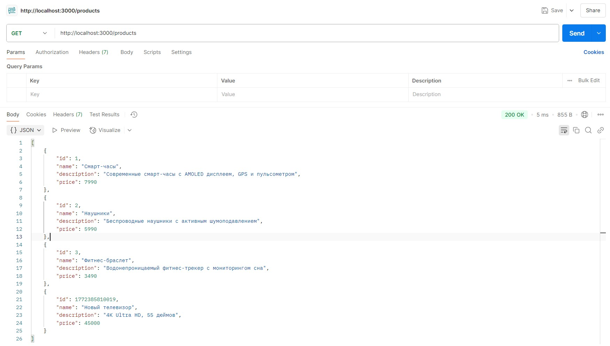
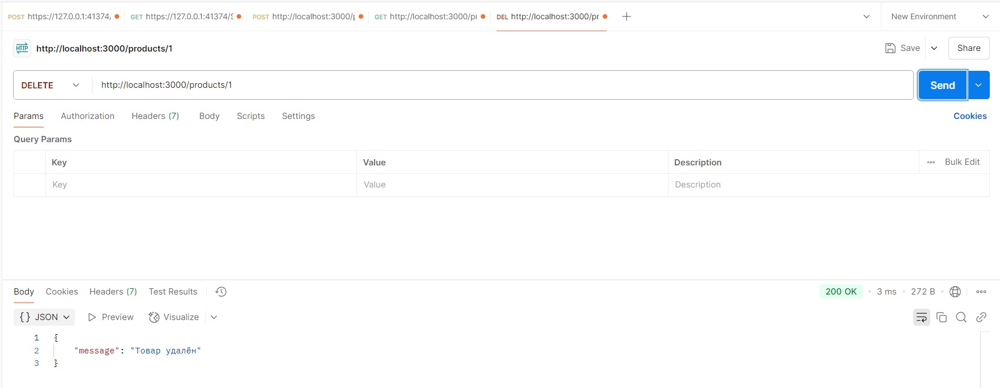
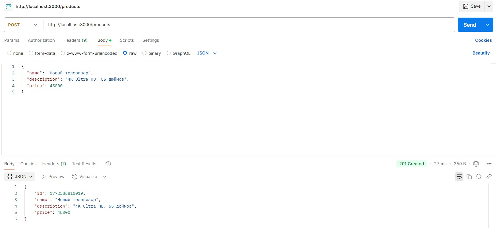

# Products API — документация запросов (проект `pkpal-uhobp/Frontend_and_backend_1-2`)

Базовый URL (локально): `http://localhost:3000`

По скриншотам видно, что в этом проекте API работает по путям **`/products`** (без префикса `/api`) и у товара поля:
- `id`
- `name`
- `description`
- `price`

Ниже — описание запросов и вставка скриншотов.

---

## Скриншоты (Postman)

### Получить список товаров (GET /products)


### Удалить товар (DELETE /products/:id)


### Создать товар (POST /products)


---

## Модель товара (Product)

Пример объекта товара (как в ответах на скриншотах):

```json
{
  "id": 1,
  "name": "Смарт-часы",
  "description": "Современные смарт-часы с AMOLED дисплеем, GPS и пульсометром",
  "price": 7990
}
```

Поля:
- `id` (number) — идентификатор товара (генерируется сервером)
- `name` (string) — название товара
- `description` (string) — описание товара
- `price` (number) — цена товара

---

## 1) Получить список товаров

**GET** `/products`

### Описание
Возвращает массив всех товаров.

### Пример ответа
**200 OK**:

```json
[
  {
    "id": 1,
    "name": "Смарт-часы",
    "description": "Современные смарт-часы с AMOLED дисплеем, GPS и пульсометром",
    "price": 7990
  },
  {
    "id": 2,
    "name": "Наушники",
    "description": "Беспроводные наушники с активным шумоподавлением",
    "price": 5990
  }
]
```

### cURL
```bash
curl "http://localhost:3000/products"
```

---

## 2) Создать товар

**POST** `/products`

### Описание
Создаёт новый товар и возвращает созданный объект с `id`.

### Заголовки (Headers)
- `Content-Type: application/json`

### Тело запроса (Body)
Пример (как на скриншоте):

```json
{
  "name": "Новый телевизор",
  "description": "4K Ultra HD, 55 дюймов",
  "price": 45000
}
```

### Пример ответа
**201 Created**:

```json
{
  "id": 1772385810019,
  "name": "Новый телевизор",
  "description": "4K Ultra HD, 55 дюймов",
  "price": 45000
}
```

### cURL
```bash
curl -X POST "http://localhost:3000/products" \
  -H "Content-Type: application/json" \
  -d "{\"name\":\"Новый телевизор\",\"description\":\"4K Ultra HD, 55 дюймов\",\"price\":45000}"
```

---

## 3) Удалить товар по ID

**DELETE** `/products/:id`

### Описание
Удаляет товар по `id`.

### Параметры пути (Path params)
- `id` — идентификатор товара

Пример:
- `DELETE http://localhost:3000/products/1`

### Пример ответа
**200 OK**:

```json
{
  "message": "Товар удалён"
}
```

### cURL
```bash
curl -X DELETE "http://localhost:3000/products/1"
```

---
